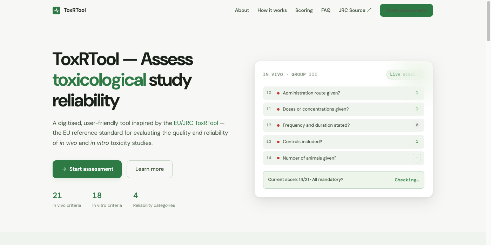

# ToxRTool Web

A modern, browser-based implementation of the **EU/JRC ToxRTool** — the standardised checklist for evaluating the reliability of toxicological studies.



**Live site:** https://carlottalupatelli.github.io/toxrtool/
**Source:** https://github.com/carlottalupatelli/toxrtool

---

## What it does

ToxRTool guides evaluators through a structured set of criteria to assign a **Klimisch reliability category (1–4)** to any toxicological study. Supports both study types:

| Study type | Criteria | Mandatory |
|------------|----------|-----------|
| In vivo    | 21       | 8         |
| In vitro   | 18       | 6         |

### Reliability categories

| Category | Meaning | Condition |
|----------|---------|-----------|
| **1** | Reliable without restrictions | High score + all mandatory met |
| **2** | Reliable with restrictions | Mid score + all mandatory met |
| **3** | Not reliable | Low score or mandatory criterion failed |
| **4** | Not assignable | Insufficient documentation |

---

## Features

- Automatic scoring → Categories A (raw) and B (mandatory-adjusted)
- Evaluator override (Category C) with justification field (D)
- Optional regulatory relevance section
- Export to **Excel (.xlsx)** — multi-sheet, faithful to the original format
- **Print / Save as PDF** via browser
- Auto-save to `localStorage` — nothing is lost on refresh
- Shareable links — full assessment state encoded in the URL hash
- Zero backend — runs entirely in the browser, no installation needed

---

## Run locally

No build step required:

```bash
python -m http.server 8000
# then open http://localhost:8000
```

---

## Attribution

This web implementation has been **approved by the original authors and the JRC**.

**Original publication:**
Schneider K, Schwarz M, Burkholder I, Kopp-Schneider A, Edler L, Kinsner-Ovaskainen A, Hartung T, Hoffmann S (2009). *ToxRTool, a new tool to assess the reliability of toxicological data.* Regulatory Toxicology and Pharmacology, 54(2), 162–173. [doi:10.1016/j.yrtph.2009.06.006](https://doi.org/10.1016/j.yrtph.2009.06.006)

**Original tool:** [EURL ECVAM / JRC](https://joint-research-centre.ec.europa.eu/scientific-tools-and-databases/toxrtool-toxicological-data-reliability-assessment-tool_en)

---

## License

MIT
